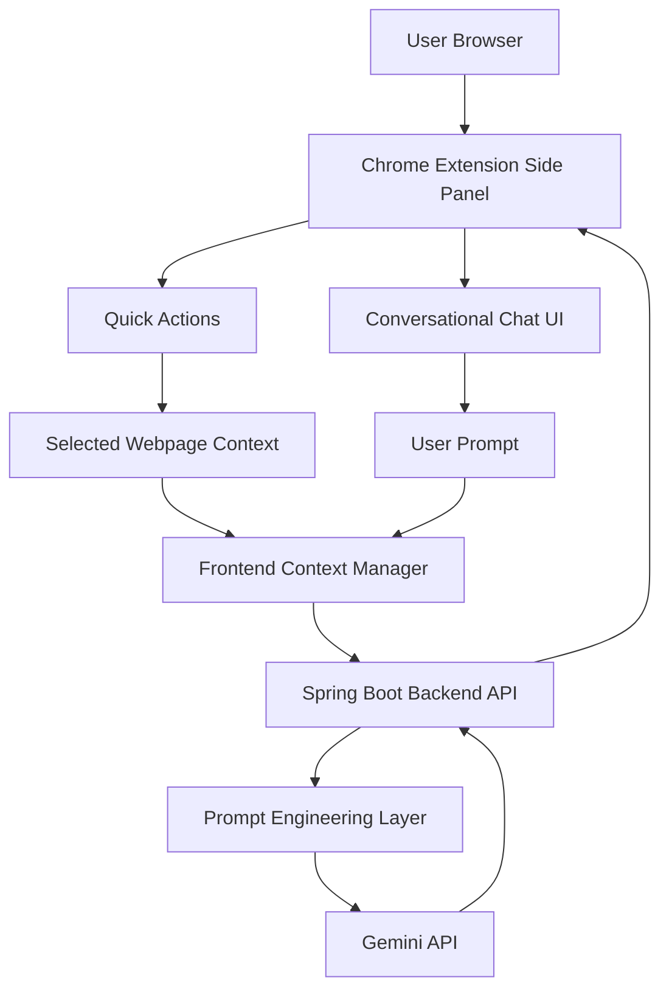

# 🧠 Citezen


Citezen is a contextual AI-powered research assistant built as a Chrome Extension with a Spring Boot backend. It helps users summarize, explain, simplify, and analyze web content directly from the browser without interrupting their workflow.

Unlike traditional chatbot interfaces, Citezen combines conversational AI with context-aware webpage interactions, enabling users to highlight content on any webpage and perform instant AI-assisted research actions.

---

# 📋 Table of Contents

* [The Problem](#the-problem)
* [Features](#features)
* [System Architecture](#system-architecture)
* [How It Works](#how-it-works)
* [Tech Stack](#tech-stack)
* [Installation](#installation)
* [Configuration](#configuration)
* [Running the System](#running-the-system)
* [Project Structure](#project-structure)
* [Current Capabilities](#current-capabilities)
* [Planned Roadmap](#planned-roadmap)
* [Design Decisions](#design-decisions)
* [License](#license)

---

# The Problem

Most AI assistants are designed as standalone chat applications. While useful for general conversations, they interrupt research workflows because users constantly need to:

* switch tabs
* copy-paste content
* manually provide context
* re-explain previous information

Citezen aims to reduce this friction by embedding AI assistance directly into the browser workflow.

Instead of acting as only a chatbot, Citezen functions as a contextual research copilot capable of interacting with selected webpage content while also supporting conversational follow-up interactions.

---

# Features

## Core Features

| Feature                     | Description                                                                     |
| --------------------------- | ------------------------------------------------------------------------------- |
| Context-aware quick actions | Summarize, explain, simplify, and extract key points from selected webpage text |
| Conversational AI interface | Chat-based interaction for follow-up questions and general research assistance  |
| Markdown rendering          | AI responses support formatted markdown output                                  |
| Streaming-style responses   | Simulated live response rendering for improved UX                               |
| Context memory              | Maintains short conversational context for follow-up interactions               |
| Modern side-panel UI        | Minimal black-and-white AI workspace inspired by modern AI assistants           |
| Chrome MV3 extension        | Uses Chrome Side Panel API and Manifest V3 architecture                         |

---

# System Architecture



---

# How It Works

## Quick Action Workflow

1. User selects text from a webpage
2. User clicks an action such as:

   * Summarize
   * Explain
   * Simplify
   * Key Points
3. The selected content is sent to the Spring Boot backend
4. Backend constructs a contextual prompt
5. Gemini API generates the response
6. Response is rendered inside the Citezen chat interface

---

## Conversational Workflow

1. User enters a custom query in the chat interface
2. Frontend sends:

   * user message
   * recent conversation history
   * currently selected context (if available)
3. Backend builds a contextual prompt
4. Gemini generates a conversational response
5. Frontend streams the formatted response progressively

---

# Tech Stack

| Component          | Technology                 |
| ------------------ | -------------------------- |
| Frontend           | HTML, CSS, JavaScript      |
| Extension Platform | Chrome Extension MV3       |
| UI Architecture    | Side Panel API             |
| Backend            | Spring Boot                |
| HTTP Client        | Spring WebClient           |
| AI Model           | Gemini API                 |
| Markdown Rendering | marked.js                  |
| Styling            | Custom CSS                 |
| State Management   | In-memory frontend context |

---

# Installation

## 1. Clone the repository

```bash
git clone https://github.com/yourusername/citezen.git
cd citezen
```

---

## 2. Start the backend

```bash
./mvnw spring-boot:run
```

Backend runs on:

```text
http://localhost:8080
```

---

## 3. Load the Chrome Extension

1. Open:

   ```text
   chrome://extensions
   ```

2. Enable:

   ```text
   Developer Mode
   ```

3. Click:

   ```text
   Load unpacked
   ```

4. Select the extension folder

---

# Configuration

Configure your Gemini API key in:

```text
application.properties
```

Example:

```properties
gemini.api.key=YOUR_API_KEY
```

---

# Running the System

1. Start Spring Boot backend
2. Load Chrome extension
3. Open any webpage
4. Open Citezen side panel
5. Select webpage text and use quick actions
6. Continue with conversational follow-up questions

---

# Project Structure

```text
citezen/
│
├── backend/
│   ├── ResearchController.java
│   ├── ResearchService.java
│   ├── ResearchRequest.java
│   └── GeminiResponse.java
│
├── extension/
│   ├── manifest.json
│   ├── sidepanel.html
│   ├── sidepanel.css
│   ├── sidepanel.js
│   └── marked.min.js
│
└── README.md
```

---

# Current Capabilities

Citezen currently supports:

* Context-aware webpage summarization
* Conversational AI interactions
* Short-term conversation memory
* Markdown-rendered AI responses
* Streaming-style response rendering
* Quick AI actions on selected text
* Professional side-panel research interface

---

# Planned Roadmap

The following improvements are planned for future iterations of Citezen.

## Persistent Conversations

* Save and restore chat sessions
* Local conversation storage using Chrome APIs
* Conversation history management

---

## Cross-Tab Research Memory

* Maintain contextual continuity across browser tabs
* Shared research context between active sessions
* Better multi-tab workflow support

---

## Local LLM Support

* Optional support for local AI models
* Reduced dependency on external APIs
* Offline/private research workflows

Potential integrations:

* Ollama
* ONNX Runtime
* llama.cpp

---

## Intelligent Knowledge Organization

Future versions may include an optional research memory system capable of:

* identifying potentially useful browsing information
* deciding whether information is worth storing
* organizing knowledge internally by topic/context
* improving long-term research continuity

This feature is still exploratory and not yet implemented.

---

## Real Streaming Responses

Current streaming behavior is simulated in the frontend.

Future versions may implement:

* Server-Sent Events (SSE)
* token-level streaming
* real-time backend response streaming

---

# Design Decisions

## Why a Chrome Side Panel?

The side panel allows AI assistance to remain accessible without interrupting the browsing workflow.

Unlike popup-based extensions, the side panel supports:

* persistent interaction
* conversational continuity
* larger research workspace UI

---

## Why Combine Quick Actions with Chat?

Most browser AI tools focus either on:

* inline actions
  OR
* chatbot interfaces

Citezen combines both approaches:

* quick context-aware actions for speed
* conversational AI for flexibility

This creates a smoother research workflow.

---

## Why Keep Memory Short-Term?

Conversation memory is intentionally limited to recent interactions to:

* reduce token usage
* improve API efficiency
* avoid unnecessary prompt growth

Long-term memory systems are planned separately.

---

# License

This project is licensed under the MIT License.
